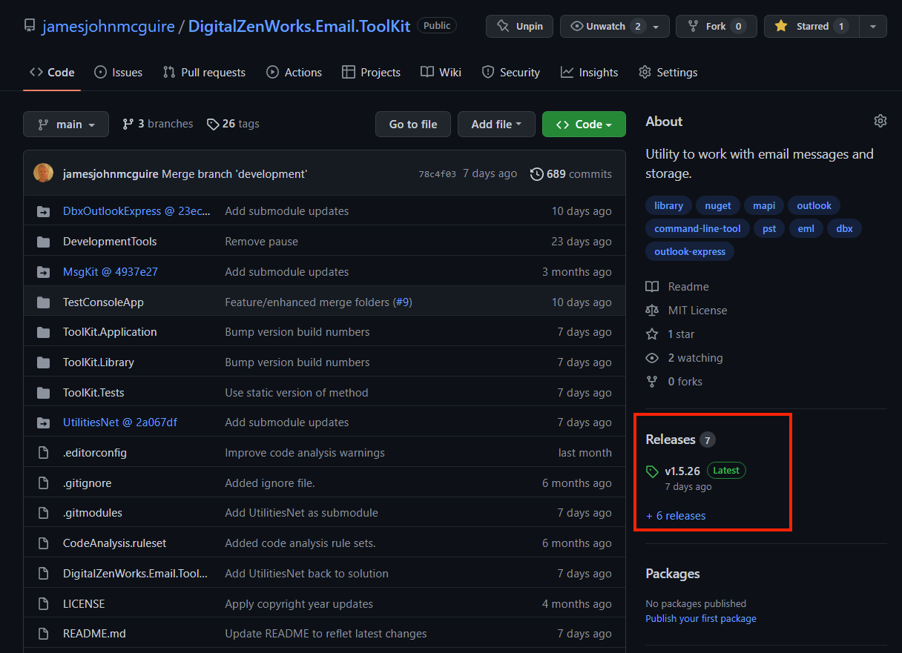
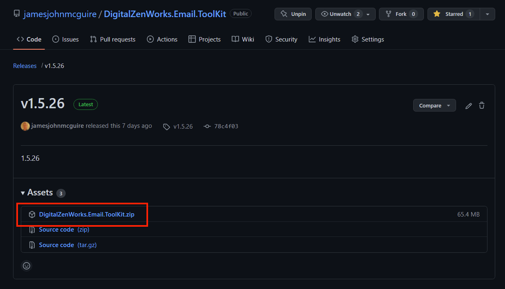

# DigitalZenWorks.Email.ToolKit

This is a C# application and library for interacting with email messages and storage.

Please :star: star this project!

## Getting Started

### Installation

#### Prerequisites

Outlook Needs to be installed on the same computer as this program.

#### Downloading the Program

If you are just interested in using the program, you can download the latest release by the following process:

1 Go to the releases tab   
2 Then choose the DigitalZenWorks.Email.ToolKit.zip package   
3 Unzip the files somewhere accessible on your PATH  

Refer to 'Usage' section below.  

#### Git
    git clone --recurse-submodules https://github.com/jamesjohnmcguire/DigitalZenWorks.Email.ToolKit  

This project includes the [DbxOutlookExpress project](https://github.com/jamesjohnmcguire/DbxOutlookExpress) as a submodule.  So, be sure to include submodules when retreiving the repository contents. 

#### Nuget
    PM> Install-Package DigitalZenWorks.Email.ToolKit

### Usage:

NOTE: Always back up any data you might be modifying.  This package has been tested with hundreds of thousands of messages, 
more than 50 GBs of data, without any problems.  But there can always be a first.  So, please back up your data before using this tool.  Did I mention that you should back up?  

This is, currently, a command line program to be run from the command line or terminal.  

#### Command line usage:

DigitalZenWorks.Email.ToolKit \<command\> \<source-path\> \<destination-path\>  

| Commands:             |                                        | options        |
| --------------------- | -------------------------------------- | -------------- |
| dbx-to-pst            | Migrate dbx files to pst file          | -e, --encoding |
| eml-to-pst            | Migrate eml files to pst file          | -a, --adjust   |
| list-folders          | List all sub folders of a given folder | -r, --recurse  |
| list-top-senders      | List the top senders of a given store  | -cm --count    |
| list-total-duplicates | List all duplicates in a given store   |                |
| merge-folders         | Merge duplicate Outlook folders        | -n, --dryrun   |
| merge-stores          | Merge one store into another           |                |
| move-folder           | Move one folder to another             |                |
| remove-duplicates     | Remove duplicate messages              | -n, --dryrun   |
|                       |                                        | -s, --flush    |
| remove-empty-folders  | Prune empty folders                    |                |
| help                  | Display this information               |                |

##### Command line usage notes:
The command is optional if the command can be inferred from the source-path.  For example, if the source path is a directory containing *.eml files, they will processed accordingly.  
If the source-path is a directory, the command will attempt to process the files in directory.  If the source-path is a file, it will process that file directly.  
If the output file is specified, it must include the extension '.pst'.  

###### Examples
Det.exe remove-duplicates --dryrun \path\to\some.pst  
Det.exe dbx-to-pst --encoding shift_jis \path\to\some-dbx-files  
Det.exe dbx-to-pst \path\to\some-dbx-files \path\to\some.pst  
Det.exe eml-to-pst --adjust "%USERPROFILE%\AppData\Local\Microsoft\Windows Live Mail\Storage Folders" %USERPROFILE%\Import.pst  
Det.exe move-folder \path\to\some.pst source\folder\path  \path\to\some.pst destination\folder\path
Det.exe list-folders \path\to\some.pst some\folder\path
Det.exe list-top-senders \path\to\some.pst
Det.exe list-total-duplicates \path\to\some.pst

###### dbx-to-pst
The optional --encoding option allows you to add a preferred encoding, in the rare case, that encoding can not be detected properly.  It must be a string that is recognized by Encoding.GetEncoding, along with Encoding.RegisterProvider(CodePagesEncodingProvider). Valid encoding strings can be found here: https://learn.microsoft.com/en-us/dotnet/api/system.text.encoding?view=net-7.0  
If a PST file location is not specified, it will use the base location of the DBX files.

###### eml-to-pst
Some applications, like 'Windows Live Mail' often include interim folders, such as 'Imported Folders', 'Local Folders' and 'Storage Folders', creating unnecessary levels of nested folders.  Using the --adjust option will remove these interim folders in the PST file.

###### merge-folders
Sometimes, folders get duplicated, like in the following manner:  
Testing  
Testing (1)  
Testing (1) (1)  
Testing (1) (2)  

If you ever try to move or copy a folder to a place where a folder with that name exists, Outlook will add, but will give it a name an appendix like ' (1)'.  In import or export processes, often these are the exact same folders, so you can end up with multiple duplicate folders like this.  This will merge these folders into a single folder.  If there are duplicate mail items, these will copied.  So, this wil not remove the duplicate mail items.  But, it doesn't create any duplicates and the merging of folders, is an essential precursor to the eventual duplicates removal.  

###### move-folder
The third and fifth parameters specify the folder path with Outlook itself, starting with the root folder name.  The root folder name will almost always be the same as the PST file name.  You can also check at the very top folder for the PST within Outlook.  

###### remove-duplicates
If no PST path is provided, it will attempt to remove all duplicates in all folders in all stores of the default or current Outlook account.  
Use the --dryrun option to see which messages WOULD be deleted.  
Use --flush to empty the deleted items folder at the end.  
For large stores, this can take some time.

#### Library and API usage:
Except for command line argument processing, all of the functionality is located in the main library project.  The main APIs match the command line commands.

The main classes are Migrate, OutlookFolder, OutlookItem and OutlookStore.  
Migrate is for migrating messages in other formats into Outlook.  Some examples:  
```c#
Migrate.DbxToPst(dbxPath, pstPath);  
Migrate.EmlToPst(dbxPath, pstPath);  
```
OutlookAccount acts on the entire default or current Outlook account.  OutlookStore acts on a specific store (PST file).  OutlookFolder acts on a specific folder. 
For cleaning up Outlook, you could use the following:  
```c#
OutlookAccount outlookAccont = new ();  
outlookAccont.MergeFolders();  
outlookAccont.RemoveDuplicates();  
```

## Contributing

If you have found a bug or have a suggestion that would make this better, please fork this repository and create a pull request. You can also simply open an issue with the tag "bug" or "enhancement".

### Process:

1. Fork the Project
2. Create your Bug / Feature Branch (`git checkout -b feature/amazing-feature`)
3. Commit your Changes (`git commit -m 'Add some amazing feature'`)
4. Push to the Branch (`git push origin feature/amazing-feature`)
5. Open a Pull Request

### Coding style
Please match the current coding style.  Most notably:  
1. One operation per line
2. Use complete English words in variable and method names
3. Attempt to declare variable and method names in a self-documenting manner


## License

Distributed under the MIT License. See `LICENSE` for more information.

## Contact

James John McGuire - [@jamesmc](https://twitter.com/jamesmc) - jamesjohnmcguire@gmail.com

Project Link: [https://github.com/jamesjohnmcguire/DigitalZenWorks.Email.ToolKit](https://github.com/jamesjohnmcguire/DigitalZenWorks.Email.ToolKit)
